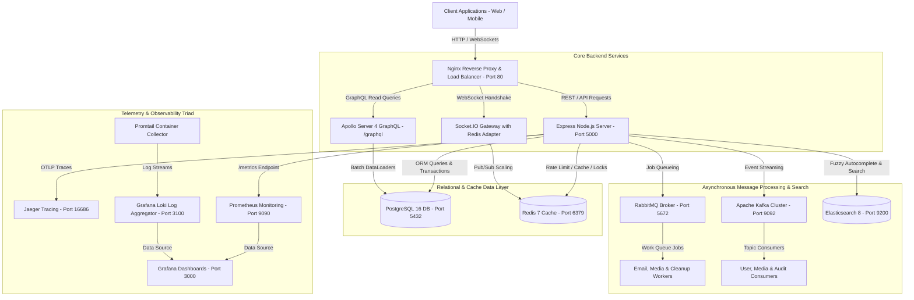

# 🚀 OmniMedia Enterprise Backend API v2.0

> **Production-Grade Real-Time Multimedia Backend Infrastructure**  
> Built with Node.js, TypeScript, PostgreSQL (Sequelize), Redis, RabbitMQ, Apache Kafka, Elasticsearch, Apollo Server 4 GraphQL, Socket.IO, OpenTelemetry (Jaeger), Prometheus, Grafana Loki, and Nginx.

---

## 🏗️ System Architecture Overview



---

## 🔥 Key Architectural Features

1. **Hybrid API Architecture**:
   - **REST API**: Used strictly for state-mutating commands, authentication (`/api/v1/auth`), uploads (`/api/v1/uploads`), and search (`/api/v1/search`).
   - **GraphQL Read API**: Powered by Apollo Server 4 at `/graphql`. Handles all data fetching (`me`, `user`, `files`, `myNotifications`, `auditLogs`) using **Batch DataLoaders** to eliminate $N+1$ database query hazards.

2. **Unified Upload System & Compensating Transactions**:
   - Implements the **Strategy Pattern** (`ProfileImageStrategy`, `CoverImageStrategy`, `PostMediaStrategy`, `DocumentStrategy`, `AudioStrategy`, `VideoStrategy`).
   - Enforces strict MIME type and file size validations.
   - Executes **Compensating Transactions**: If PostgreSQL metadata saving fails after a Cloudinary stream upload, the system automatically triggers compensating Cloudinary deletion (or enqueues a retry job to RabbitMQ `cleanup.queue`).

3. **Asynchronous Messaging & Distributed Event Streaming**:
   - **RabbitMQ**: Fair-dispatch work queues with Dead Letter Queue (DLQ) support for background job retries (`email.queue`, `media.queue`, `cleanup.queue`).
   - **Apache Kafka**: High-throughput distributed event streaming across partitioned topics (`omnimedia.user.events`, `omnimedia.media.events`, `omnimedia.audit.events`).

4. **Real-Time WebSocket Gateway**:
   - Powered by **Socket.IO** attached to `@socket.io/redis-adapter` for horizontal multi-instance scaling.
   - Targeted push notifications via isolated user rooms (`user:${userId}`).

5. **Production-Grade Observability Triad**:
   - **Metrics**: RED Method (Rate, Errors, Duration) collected via `prom-client` at `/metrics` and scraped by Prometheus.
   - **Traces**: End-to-end OpenTelemetry SDK auto-instrumentation exported to Jaeger UI.
   - **Logs**: Structured Pino JSON logs collected by Promtail and aggregated in Grafana Loki.

---

## ⚡ Quickstart Guide

### 1. Prerequisites
- **Docker & Docker Compose** (v24+)
- **Node.js** (v20 LTS or higher)
- **npm** (v10+)

### 2. Environment Configuration
Copy `.env.example` to `.env`:
```bash
cp .env.example .env
```

### 3. Start Infrastructure Stack (Docker Compose)
Launch PostgreSQL, Redis, RabbitMQ, Kafka, Zookeeper, Elasticsearch, Prometheus, Grafana, Loki, Promtail, Jaeger, and Nginx:
```bash
docker compose up -d
```

### 4. Install Dependencies
```bash
npm install
```

### 5. Run in Development Mode
Start the live backend application with auto-reloading (`ts-node-dev`):
```bash
npm run dev
```

### 6. Run Automated Test Suite
Execute unit and integration tests via Jest with open handle detection:
```bash
npm test
```

### 7. Run TypeScript Type Check
Ensure 100% type safety across the entire codebase:
```bash
npx tsc --noEmit
```

---

## 🌐 Endpoints & Service Dashboard Directory

| Service / Interface | Protocol | Access URL / Endpoint | Credentials |
| :--- | :--- | :--- | :--- |
| **Express API Gateway** | HTTP | `http://localhost:5000` | N/A |
| **Nginx Reverse Proxy** | HTTP | `http://localhost:80` | N/A |
| **Swagger API Docs** | HTTP | `http://localhost:5000/api-docs` | N/A |
| **Apollo GraphQL Playground** | HTTP | `http://localhost:5000/graphql` | JWT Bearer Token |
| **Health Check Endpoint** | HTTP | `http://localhost:5000/health` | N/A |
| **Prometheus Metrics** | HTTP | `http://localhost:5000/metrics` | N/A |
| **Prometheus Server UI** | HTTP | `http://localhost:9090` | N/A |
| **Grafana Dashboards** | HTTP | `http://localhost:3000` | `admin` / `admin` |
| **Jaeger Tracing UI** | HTTP | `http://localhost:16686` | N/A |
| **RabbitMQ Console** | HTTP | `http://localhost:15672` | `omnimedia` / `omnimedia_password` |
| **Elasticsearch Cluster** | HTTP | `http://localhost:9200` | N/A |

---

## 📚 API Endpoint Specification

### 🔑 REST Authentication (`/api/v1/auth`)
- `POST /register`: Register a new user with password complexity policy (min 8 chars, 1 uppercase, 1 lowercase, 1 number, 1 special char).
- `POST /login`: Authenticate user and issue JWT Access/Refresh tokens.
- `POST /request-login-otp`: Request 6-digit email OTP.
- `POST /verify-login-otp`: Verify email OTP and authenticate.
- `POST /refresh`: Rotate access token using valid refresh token.
- `POST /logout`: Revoke refresh token and invalidate session.

### 📤 REST Uploads (`/api/v1/uploads`)
- `POST /single`: Stream upload file to Cloudinary with strategy validation and PostgreSQL transaction.

### 🔍 REST Search (`/api/v1/search`)
- `GET /autocomplete`: Fast `edge_ngram` search autocomplete suggestions from Elasticsearch.

### 🔮 GraphQL Read API (`/graphql`)
- `Query me`: Fetch authenticated user profile.
- `Query user(id: ID!)`: Fetch public user profile by ID.
- `Query files(fileType: FileType, limit: Int, offset: Int)`: FetchPaginated media files.
- `Query file(id: ID!)`: Fetch single file metadata with associated user and tags via DataLoaders.
- `Query myNotifications(limit: Int)`: Fetch real-time notification history for current user.
- `Query auditLogs(limit: Int)`: Fetch system audit log entries.

---

## 🛠️ Project Structure

```
backend/
├── Dockerfile                  # Multi-stage production Docker build
├── docker-compose.yml          # Local infrastructure stack (12 container services)
├── jest.config.ts              # Jest unit & integration test configuration
├── tsconfig.json               # Strict TypeScript compilation options
├── prometheus.yml              # Prometheus scraping configuration
├── loki-config.yml             # Grafana Loki storage configuration
├── promtail-config.yml         # Promtail container log collector rules
├── nginx/                      # Nginx reverse proxy configuration & load balancer
│   ├── nginx.conf
│   └── conf.d/default.conf
└── src/
    ├── app.ts                  # Express application factory & middleware setup
    ├── server.ts               # Server bootstrap & graceful shutdown coordinator
    ├── config/                 # Environment, Redis, RabbitMQ, Kafka, ES, Tracing configs
    ├── common/                 # Global middleware, logger, errors, utils
    ├── infrastructure/         # Postgres models, ES index manager, messaging producers
    ├── graphql/                # Apollo Server 4 schema, resolvers, context & DataLoaders
    ├── modules/                # REST Modules (auth, uploads, search, notifications)
    ├── workers/                # RabbitMQ async consumer workers (email, media, cleanup)
    ├── consumers/              # Kafka event topic consumers
    └── tests/                  # Unit & Integration Jest test suites
```

---

## 📄 Architectural Interview Cheatsheet
For full technical deep-dives into all 75 architectural interview questions across all 14 project phases, refer to:
👉 **[`PROJECT_QNA_CHEATSHEET.md`](file:///mnt/d/Workspace/Task/PROJECT_QNA_CHEATSHEET.md)**
